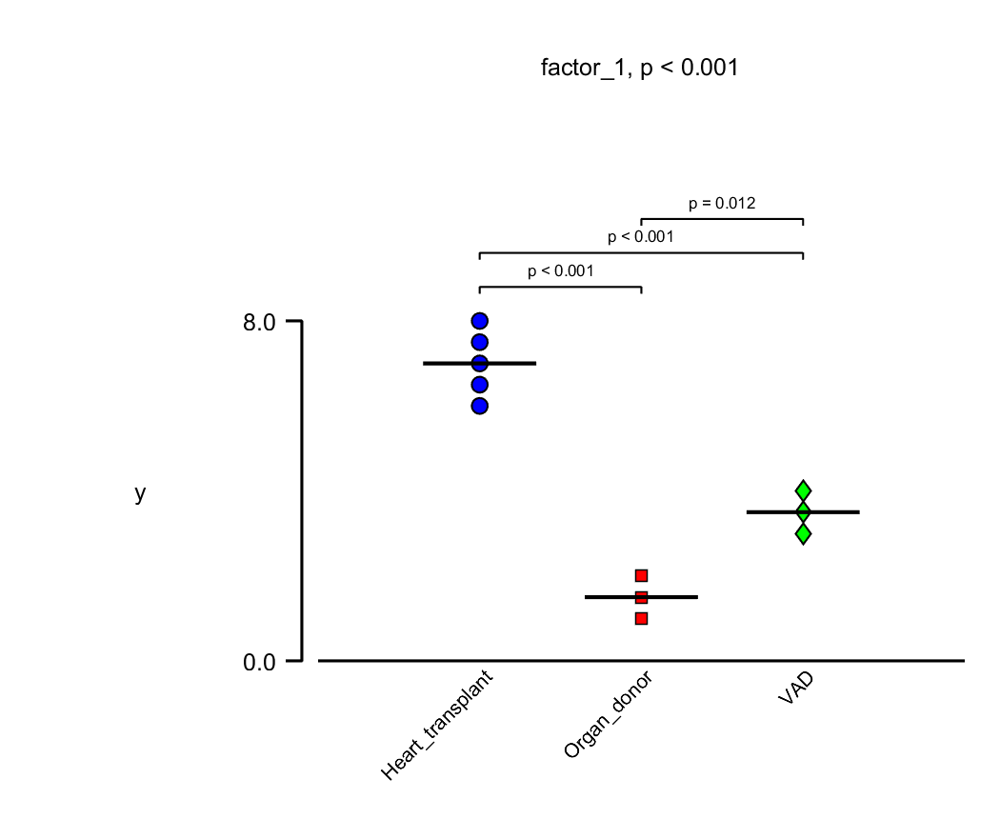

## One-way model in MATLAB

Update your local copies of
+ [MATLAB_utilities](https://github.com/Campbell-Muscle-Lab/MATLAB_Utilities)
+ [MATLAB_SAS](https://github.com/Campbell-Muscle-Lab/MATLAB_SAS)

Make sure you have read and understand the [accompanying SAS page](..\..\SAS\one_way_model\one_way_model.html)

# Implementation

MATLAB needs a place to store the SAS code and the SAS output file. Create the following sub-folders
+ sas_code
+ sas_results

in your working directory.

Then run [one_way_linear_mixed_model.m](one_way_linear_mixed_model.m)

````
function one_way_linear_mixed_model
% Code runs a one-way linear mixed model

data_file_string = 'data\one_way_data.xlsx';

one_way_jitter( ...
    data_file_string, ...
    'y', ...
    'factor_1', ...
    'excel_sheet', 'Sheet1', ...
    'grouping', 'grouping', ...
    'calling_path_string', cd)

print('one_way_jitter.png')
````

## Output



## Tips

+ SAS cannot open Excel files that are already open
  + close your Excel file before trying to run the MATLAB code
+ including spaces in the group names crashes the attempt to scrape data from the SAS html output
  + thus, "Organ_donor" instead of "Organ donor"
+ the code logs status in sas_code.log
  + use this file for trouble-shooting tips (e.g. SAS cannot open the Excel file, etc.)
+ similarly, sas_results\sas_results.html, can also be useful for trouble-shooting
