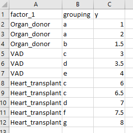
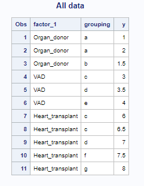
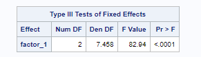
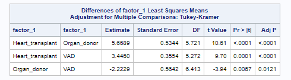

# Example data

The image shows example data which you can download [here](one_way_data.xlsx)



There 


# One-way model in SAS

## Code

The SAS code to run a 1-way linear mixed model is as follows (adjust your paths as required).

````
/* SAS template for a 1 way analysis with a grouping variable */

proc import out = work.all_data
	datafile = "C:\ken\GitHub\CampbellMuscleLab\howtos\howtos_linear_mixed_models\docs\pages\MATLAB\one_way_model\data\one_way_data.xlsx"
	dbms = xlsx replace;
	sheet = "Sheet1";
	getnames=yes;
run;

ods html file="C:\ken\GitHub\CampbellMuscleLab\howtos\howtos_linear_mixed_models\docs\pages\MATLAB\one_way_model\sas_results\sas_results.html";
ods listing close;

/*data work.all_data; */
/*	modify work.all_data;*/
/*	if y = 'NaN' then y = . ;*/
/*run;*/

proc print data=all_data;
	title1 'All data';
run;

proc glimmix data=all_data;
	class factor_1 grouping;
	model y = factor_1 /ddfm=satterthwaite;
	random grouping;
	lsmeans factor_1 /slice = factor_1 pdiff adjust=tukey;
run;

ods listing;
ods html close;
````

## Results

When run in the SAS environment, this produces an [output file in html format](sas_results.html)

## Interpretation

The top section of the results file shows the input data.



The next section that is critically important is the fixed effect section.



Here, the p value for factor_1 is <0.0001. This indicates that the 3 experimental groups are statistically different.

The last section shows the post-hoc tests.



These show:
+ Heart_transplant is different than Organ_donor, p < 0.0001
+ Heart_transplant is different than VAD, p < 0.0001>
+ Organ_donor is different than VAD, p = 0.0121


