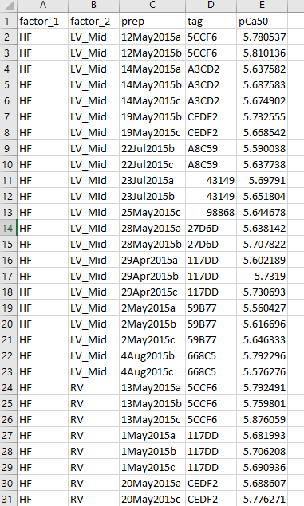
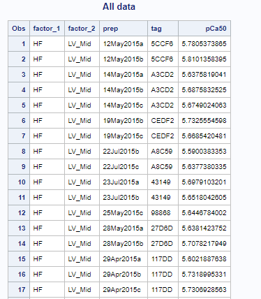
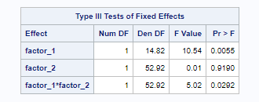
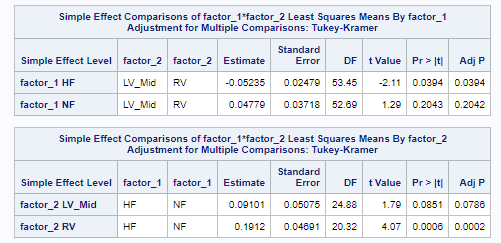

## Example data

The image shows the top part of the example data which you can download [here](two_way_data.xlsx)



The 4 columns are as follows:
+ factor_1: one of HF or NF
+ factor_2: one of LV_Mid or RV
+ prep: a string that is unique to each row
+ tag: a string that defines the person the data that was obtained from
  + For example, the top 2 rows have the same tag "5CCF6".
    + This means we have 2 values for HF, LV_Mid from person 5CCF6.this factor is used to define "repeated measures".
  + If you look further down the [data file](two_way_data.xlsx)
    + you can see that we also have 3 values from this person from the RV
+ pCa50: the data we are testing


## Two-way model in SAS

### Code

The [SAS code](sas_code.sas) to run a 2-way linear mixed model is as follows (adjust your paths as required).

````
/* SAS template for a 2 way analysis with a grouping variable */

proc import out = work.all_data
	datafile = "C:\ken\GitHub\CampbellMuscleLab\howtos\howtos_linear_mixed_models\docs\pages\MATLAB\two_way_model\data\two_way_data.xlsx"
	dbms = xlsx replace;
	sheet = "Sheet1";
	getnames=yes;
run;

ods html file="C:\ken\GitHub\CampbellMuscleLab\howtos\howtos_linear_mixed_models\docs\pages\MATLAB\two_way_model\sas_results\sas_results.html";
ods listing close;

proc print data=all_data;
	title1 'All data';
run;

proc glimmix data=all_data;
	class factor_1 factor_2 tag;
	model pCa50 = factor_1 factor_2 factor_1*factor_2 /ddfm=satterthwaite;
	random tag;
	lsmeans factor_1 factor_2 factor_1*factor_2 /slice = factor_1 slice = factor_2 slicediff=(factor_1 factor_2) pdiff adjust=tukey;
run;

ods listing;
ods html close;

````

## Results

When run in the SAS environment, this produces an [output file in html format](sas_results.html)

## Interpretation

The top section of the results file shows the input data.



The next section that is critically important is section showing the main effects and their interaction.



Here, the
+ p value for factor_1 is 0.0055
  + This indicates that the HF and NF groups are statistically different
+ p value for factor_2 is 0.919
  + This indicates that there is no statistical difference between LV_Mid and RV
+ p value for factor_1 * factor_2 (interaction) is 0.029
  + This indicates that the effect of factor_1 depends on the value of factor_2

The last section shows the post-hoc tests.



These show:
+ in HF samples, LV_Mid and RV are statistically different (p=0.0394)
+ in RV samples, HF and NF are statistically different (p=0.0002)
